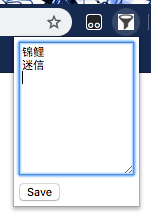

# Douban Dousay Filter -- a Chrome Extension
This extension hides unwanted Douban Guangbo (Dousay) from a [Douban](https://www.douban.com/) user's timeline.

## Installing
On [Chrome Web Store](https://chrome.google.com/webstore/detail/%E8%B1%86%E7%93%A3%E5%B9%BF%E6%92%AD%E8%BF%87%E6%BB%A4%E5%99%A8-douban-dousay-fil/mmlilcjbhccgadmbfojmjlgaegkpklnk).

## How It Works
The extension hides Dousays by keyword matches. You can enter your keywords in the popup menu, at one word per line:

Click on the "save" button, and you should be good to go.

## Known Issues
While the keyword matching script should be searching the content of the Dousay itself, currently it searches in all of the DOM Element objects -- because it's easier to implement, and it's less susceptible to frontend changes in [douban.com]. This includes some div, img and other tags, and may create false positives who gets filtered out. But this shouldn't be a huge issue since I expect most keywords in Chinese characters, and DOM tags are Roman characters.
